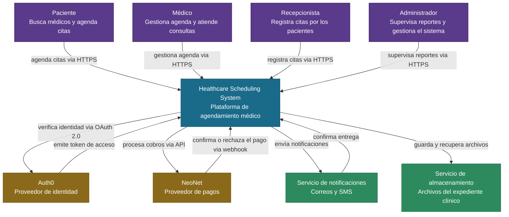

# 01 — Contexto del Sistema

## Descripción

Este diagrama muestra el Healthcare Scheduling System desde afuera — como una sola caja rodeada de las personas que lo usan y los sistemas externos con los que se conecta. No muestra cómo está organizado por dentro, solo quién interactúa con él y para qué.

El sistema tiene cuatro tipos de usuarios: los pacientes que buscan médicos y agendan citas, los médicos que gestionan su agenda y atienden consultas, las recepcionistas que registran citas en nombre de los pacientes, y los administradores que supervisan los reportes y gestionan el sistema. Para funcionar, el sistema se conecta con cuatro servicios externos: Auth0 para verificar la identidad de cada usuario al iniciar sesión, NeoNet para procesar los pagos de las consultas y los reembolsos, un servicio de notificaciones para enviar correos y SMS de confirmación y recordatorio, y un servicio de almacenamiento para guardar los archivos adjuntos al expediente clínico como recetas y resultados de laboratorio.

## Diagrama

## Decisiones de Diseño Notables

- **Auth0 como proveedor de identidad** — todos los usuarios, sin importar su rol, inician sesión a través de Auth0. El sistema recibe un token que identifica al usuario y determina qué puede hacer, sin necesidad de manejar contraseñas directamente.

- **NeoNet — Banco BI como proveedor de pagos** — el sistema nunca maneja datos de tarjetas directamente. NeoNet se encarga de todo el proceso de cobro y devuelve al sistema únicamente la confirmación o el rechazo del pago a través de su API. Al estar respaldado por Banco BI, uno de los bancos más sólidos de Guatemala, genera confianza tanto para la clínica como para los pacientes.

- **Servicio de notificaciones** — agrupa el envío de correos y mensajes en un solo actor externo. Para el correo se considera Amazon SES porque es uno de los servicios más confiables del mundo, funciona sin restricciones en Guatemala y tiene un costo muy bajo para el volumen de una clínica pequeña y mediana. Para los mensajes se considera WhatsApp Business API porque en Guatemala es el canal de mensajería más usado por los pacientes, con las primeras 1,000 conversaciones al mes gratuitas.

- **Servicio de almacenamiento** — guarda archivos del expediente clínico como recetas y resultados de laboratorio. Se considera Cloudinary porque está diseñado para equipos pequeños, es fácil de configurar, tiene un plan gratuito adecuado para el volumen de una clínica mediana y garantiza que los archivos se almacenen de forma segura.
