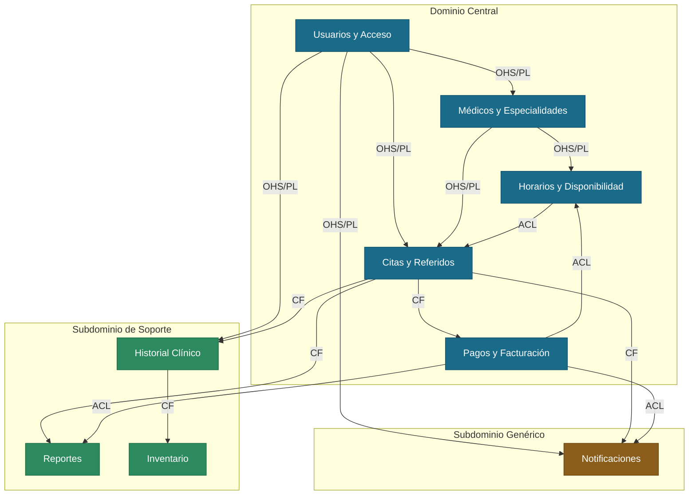

# 02 — Mapa de Contextos Delimitados (DDD Context Map)

## Descripción

Este diagrama muestra cómo se relacionan los 9 contextos delimitados del Healthcare Scheduling System. Los contextos están agrupados según su importancia para el negocio y cada relación está etiquetada con el patrón de integración que define cómo se comunican entre sí.

El Dominio Central agrupa los 5 contextos sin los cuales el sistema no puede funcionar — son la razón de existir de la plataforma. Los Subdominios de Soporte complementan al dominio central con funcionalidades importantes pero que no son el núcleo del negocio. El Subdominio Genérico contiene funcionalidad estándar que podría reemplazarse con otro servicio sin afectar el resto del sistema.

## Diagrama

## Leyenda

### Colores por tipo de dominio

| Color | Tipo | Contextos |
|---|---|---|
| Azul | Dominio Central | Usuarios y Acceso, Médicos y Especialidades, Horarios y Disponibilidad, Citas y Referidos, Pagos y Facturación |
| Verde | Subdominio de Soporte | Historial Clínico, Reportes, Inventario |
| Café | Subdominio Genérico | Notificaciones |

### Patrones de integración

| Patrón | Significado | Ejemplo en el sistema |
|---|---|---|
| **OHS/PL** | El contexto publica su información de forma estable para que otros la consuman sin conocer sus internos | Usuarios y Acceso emite un token que todos los módulos usan para verificar la identidad del usuario |
| **ACL** | El contexto traduce la información que recibe al formato propio antes de usarla | Horarios y Disponibilidad convierte el evento MedicoActivado en slots de tiempo disponibles |
| **CF** | El contexto acepta la información tal como llega sin traducirla | Notificaciones usa el evento CitaConfirmada tal como lo publica Citas y Referidos para enviar el correo |

## Explicación de los Grupos

**Dominio Central** — estos 5 contextos son el corazón del sistema. Usuarios y Acceso es el punto de entrada de todos los demás porque define quién puede usar el sistema y con qué permisos. Médicos y Especialidades define qué servicios médicos están disponibles. Horarios y Disponibilidad garantiza que no se pueda agendar dos citas en el mismo espacio. Citas y Referidos es el contexto más activo porque coordina el flujo principal del negocio. Pagos y Facturación cierra el ciclo económico de cada consulta.

**Subdominio de Soporte** — Historial Clínico guarda la información médica del paciente que se genera después de cada consulta. Reportes consolida los datos del sistema para que el administrador tome decisiones. Inventario controla los medicamentos disponibles en la clínica y reacciona cuando se emite una receta.

**Subdominio Genérico** — Notificaciones es una funcionalidad estándar de mensajería que podría reemplazarse con otro proveedor sin afectar la lógica del negocio. Su único rol es entregar mensajes a los usuarios cuando algo importante ocurre en el sistema.
