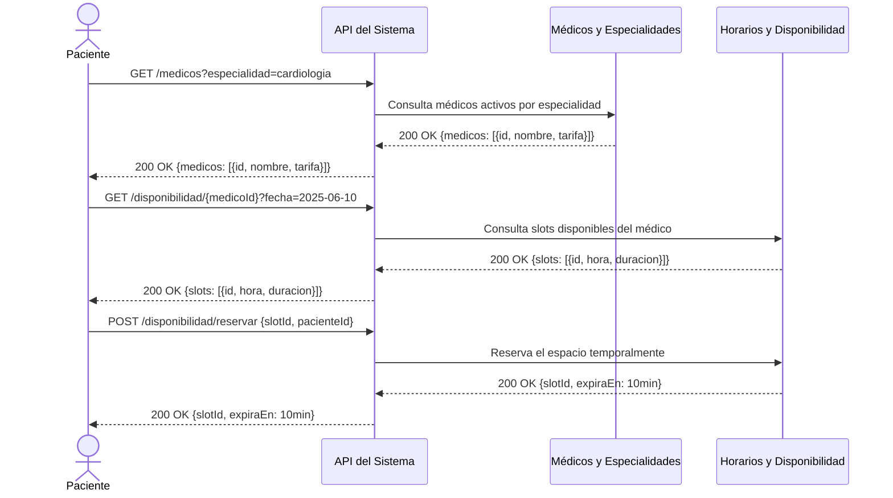
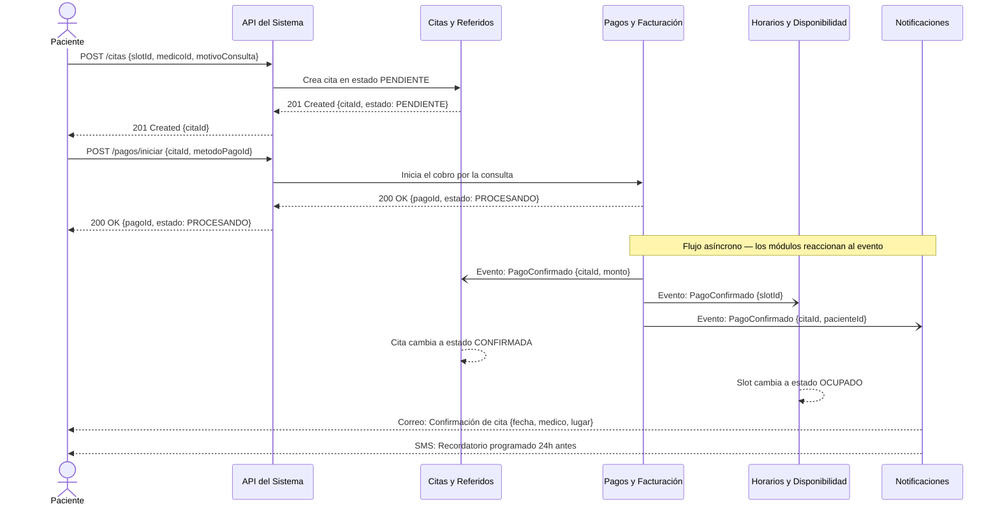
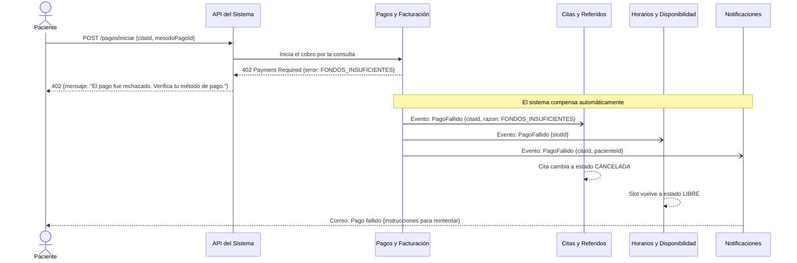
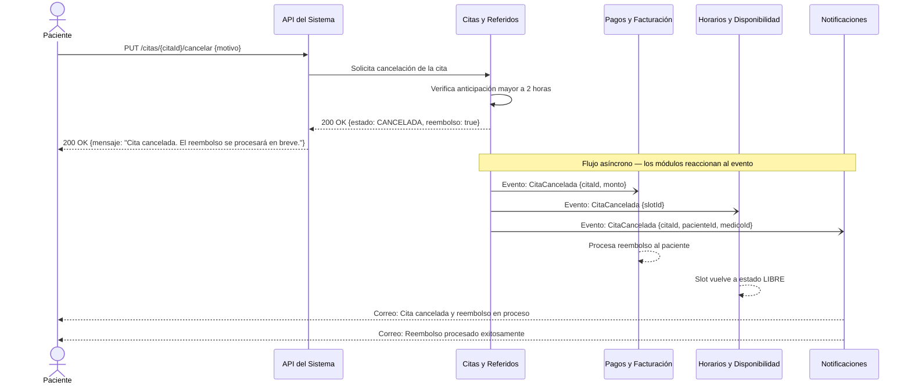
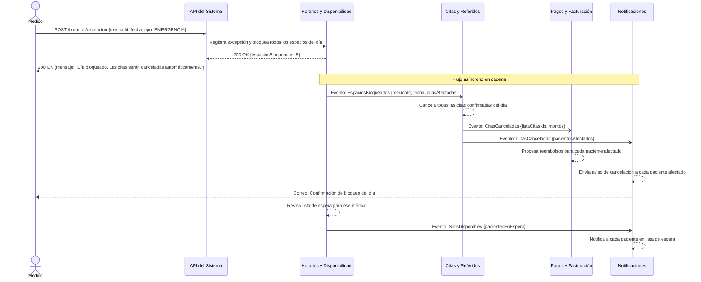

# 03 — Flujos de Datos (Diagramas de Secuencia)

Se presentan 5 diagramas de secuencia que cubren los flujos más importantes del sistema. Cada diagrama muestra paso a paso cómo se comunican los módulos, incluyendo los caminos felices y los caminos de fallo.

---

## Diagrama 1 — Agendamiento de Cita (Parte 1: Búsqueda y Reserva)

### Descripción

Un paciente busca médicos disponibles por especialidad, selecciona un horario y reserva el espacio temporalmente mientras completa el pago. Esta parte del flujo es completamente síncrona — el paciente espera la respuesta en cada paso.

---

## Diagrama 2 — Agendamiento de Cita (Parte 2: Pago y Confirmación)

### Descripción

Con el espacio reservado, el paciente confirma la cita y completa el pago. A partir de la confirmación del pago, el flujo se vuelve asíncrono — los módulos reaccionan al evento de pago confirmado de forma independiente.

---

## Diagrama 3 — Agendamiento Fallido (Pago Rechazado)

### Descripción

El paciente intenta pagar pero el cobro es rechazado. El sistema cancela la cita automáticamente, libera el espacio del médico y notifica al paciente para que reintente con otro método de pago.

---

## Diagrama 4 — Cancelación de Cita y Reembolso

### Descripción

Un paciente cancela su cita con más de 2 horas de anticipación. El sistema verifica que aplica la política de cancelación sin penalización, libera el espacio del médico, procesa el reembolso y notifica a ambas partes.

---

## Diagrama 5 — Médico Cancela y Notifica Lista de Espera

### Descripción

Un médico registra una excepción de no disponibilidad por emergencia. El sistema bloquea todos sus espacios del día, cancela las citas confirmadas, procesa los reembolsos correspondientes y notifica a los pacientes en lista de espera que hay espacios disponibles.

