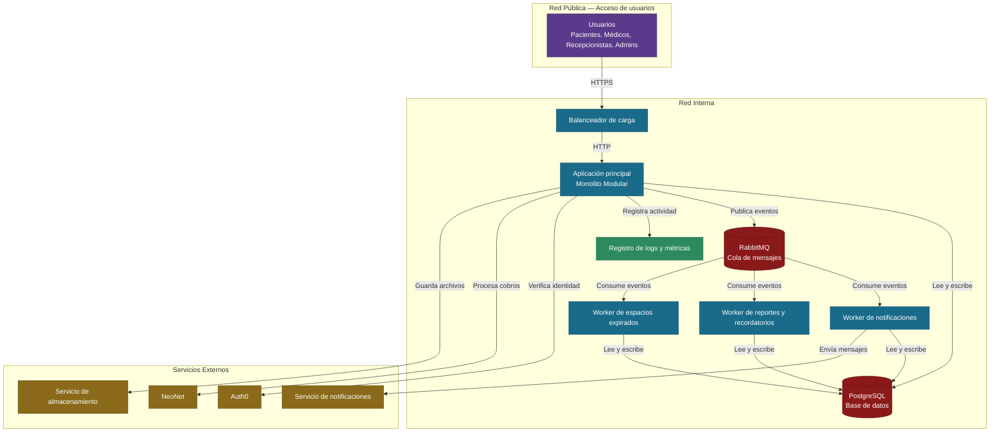

# 04 — Diagrama de Despliegue e Infraestructura

## Descripción

Este diagrama muestra cómo está organizado físicamente el Healthcare Scheduling System cuando está corriendo en producción. Se divide en tres zonas: la red pública donde los usuarios acceden al sistema, la red interna donde corren los contenedores y la base de datos, y los servicios externos que el sistema usa para funcionar.

El sistema corre como un monolito modular en un contenedor principal, acompañado de workers en contenedores separados que ejecutan las tareas automáticas en segundo plano. Todos comparten una sola base de datos PostgreSQL y se comunican entre sí a través de RabbitMQ.

## Diagrama

## Decisiones de Topología

**Monolito Modular con Event Driven**
Dentro de la aplicación principal, los módulos no se llaman directamente entre sí — se comunican a través de un bus de eventos interno. Por ejemplo, cuando el módulo de Pagos confirma un cobro, publica un evento interno que el módulo de Citas escucha para confirmar la cita. RabbitMQ se usa únicamente para la comunicación con los workers externos que corren en procesos separados.

**Balanceador de carga**
Recibe todo el tráfico de los usuarios y lo distribuye entre las instancias de la aplicación. Si el sistema necesita atender más usuarios, se agregan más instancias sin cambiar nada más.

**Aplicación principal y workers separados**
La aplicación principal atiende las solicitudes de los usuarios. Los workers se encargan de las tareas automáticas en segundo plano como notificaciones, reportes y liberar espacios expirados. Al estar separados, si un worker falla el sistema principal sigue funcionando normalmente.

**RabbitMQ como canal de mensajes**
La aplicación publica eventos y los workers los consumen cuando están disponibles. Si un worker está caído, RabbitMQ guarda los mensajes hasta que vuelva a funcionar — ningún mensaje se pierde.

**PostgreSQL como base de datos única**
Todos los componentes comparten la misma base de datos, pero cada módulo opera únicamente en su propio espacio. Es suficiente para el volumen de una clínica pequeña y mediana y mantiene el costo de infraestructura bajo.

**Sin caché**
El volumen de usuarios de clínicas pequeñas y medianas no justifica una capa de caché adicional en esta etapa. PostgreSQL responde con suficiente velocidad para este nivel de tráfico. Si el volumen crece en el futuro, se puede agregar sin cambiar la arquitectura.

**Observabilidad**
El sistema registra logs de toda la actividad y métricas de rendimiento. Esto permite identificar errores rápidamente y detectar cuando el sistema está bajo presión antes de que afecte a los usuarios.

