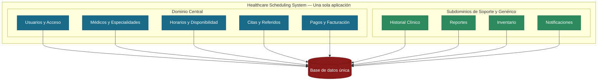
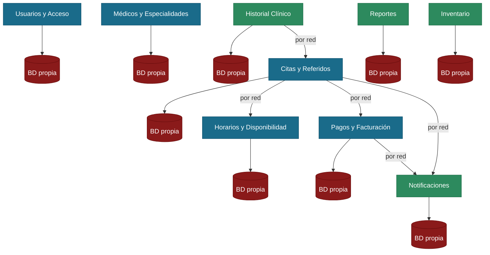

# 01 — Arquitectura de Alto Nivel

## Descripción del Sistema

El Healthcare Scheduling System es una plataforma de agendamiento de citas médicas que conecta a pacientes, médicos y administradores de clínica. El sistema permite buscar disponibilidad de médicos, reservar citas, procesar pagos por consulta, enviar recordatorios automáticos y mantener un expediente básico del paciente.

El sistema está dirigido a clínicas pequeñas y medianas. El tráfico es constante durante el horario de atención (lunes a viernes, 7am–6pm), con picos los lunes por la mañana cuando los pacientes buscan citas para la semana. También existen procesos automáticos que corren en segundo plano, como el envío de recordatorios 24 horas antes de cada cita.

El equipo de desarrollo es de 6 a 10 ingenieros.

---

## Enfoque A — Monolito Modular con Event Driven

### ¿Qué es?

Un monolito modular es una aplicación que se despliega como una sola unidad, pero cuyo código está organizado internamente en módulos bien separados. Cada módulo representa una parte del negocio (por ejemplo: agendamiento, pagos, notificaciones) y tiene sus propias reglas, su propia base de datos interna y sus propias interfaces.

La clave es que aunque todo vive en el mismo servidor, los módulos no se mezclan entre sí. Un módulo solo puede hablar con otro a través de interfaces definidas, nunca accediendo directamente a su base de datos o código interno.

A esto se le agrega la comunicación orientada a eventos: cuando algo importante ocurre en un módulo, ese módulo publica un aviso — por ejemplo, "el pago fue confirmado" — y los demás módulos que necesitan saberlo reaccionan por su cuenta. Esto mantiene los módulos independientes entre sí sin necesidad de que se llamen directamente.

### ¿Cómo aplicaría al Healthcare Scheduling System?

Con este enfoque, todo el sistema viviría en una sola aplicación. Los módulos estarían separados internamente y se comunicarían entre sí a través de eventos.

Por ejemplo, cuando un paciente confirma el pago de su cita:
- El módulo de Pagos publica el evento "pago confirmado"
- El módulo de Citas lo escucha y confirma la cita automáticamente
- El módulo de Notificaciones lo escucha y envía el correo de confirmación al paciente

Ninguno de estos módulos necesita llamar directamente al otro — simplemente reaccionan al mismo aviso de forma independiente.

Esto también significa que:

- Hay un solo proceso que levantar, monitorear y mantener.
- Un ingeniero puede seguir el flujo completo de una cita sin saltar entre repositorios o servicios.
- Cuando el paciente agenda una cita y el sistema descuenta la disponibilidad del médico, eso ocurre en una sola transacción de base de datos, lo que garantiza que nunca quede un estado inconsistente.

---

## Enfoque B — Microservicios

### ¿Qué es?

Una arquitectura de microservicios divide el sistema en servicios pequeños e independientes, donde cada uno se encarga de una sola parte del negocio. Cada servicio tiene su propio servidor, su propia base de datos y se comunica con los demás a través de la red (llamadas HTTP o mensajes).

Cada servicio puede desplegarse, actualizarse y escalarse de forma completamente independiente de los demás.

### ¿Cómo aplicaría al Healthcare Scheduling System?

Con este enfoque, el sistema estaría dividido en servicios separados: uno para agendamiento, uno para disponibilidad de médicos, uno para pagos, uno para notificaciones, uno para expedientes, uno para identidad de usuarios, y así sucesivamente.

Esto significa que:

- Si el servicio de notificaciones falla, el agendamiento sigue funcionando sin problemas.
- Si hay una campaña de vacunación masiva y el servicio de disponibilidad recibe mucho tráfico, se puede escalar solo ese servicio sin afectar los demás.
- Sin embargo, cada servicio necesita su propio proceso de despliegue, su propia base de datos y su propio monitoreo.

---

## Comparación entre los dos enfoques

| Dimensión | Monolito Modular con Event Driven | Microservicios |
|---|---|---|
| **Complejidad de despliegue** | Se despliega una sola aplicación con un pipeline | Cada servicio requiere su propio proceso de despliegue; coordinar múltiples servicios aumenta la complejidad operativa significativamente |
| **Tamaño de equipo adecuado** | Ideal para equipos de 5 a 20 ingenieros | Requiere equipos grandes; idealmente un equipo dedicado por servicio (30+ ingenieros) |
| **Escalabilidad horizontal** | Se escala toda la aplicación; suficiente para clínicas pequeñas y medianas | Se escala cada servicio por separado; necesario solo a partir de cientos de miles de usuarios |
| **Aislamiento de fallos** | Un error grave puede afectar toda la aplicación | Un servicio caído no afecta a los demás |
| **Comunicación entre módulos** | Los módulos se comunican por eventos internos dentro del mismo proceso, sin llamadas por red | Los servicios se comunican por red, lo que introduce latencia y posibles fallos de conexión |
| **Velocidad de desarrollo al inicio** | Alta: todo el equipo trabaja en un solo lugar, pueden probar el sistema completo desde su computadora sin configuración adicional | Baja: antes de escribir funcionalidad, hay que configurar cada servicio por separado y simular cómo se comunican entre ellos en la computadora de cada desarrollador |
| **Velocidad de desarrollo a largo plazo** | Puede volverse difícil de mantener con el tiempo si los desarrolladores empiezan a mezclar el código de un módulo con el de otro, rompiendo la organización inicial | Se mantiene ordenado a largo plazo porque cada servicio es independiente, pero requiere disciplina para que los cambios en un servicio no rompan los demás |
| **Costo de infraestructura** | Bajo: 2 a 4 servidores o un clúster pequeño | Alto: un clúster por servicio, bases de datos separadas, balanceadores adicionales |
| **Complejidad operativa** | Baja: si algo falla, hay un solo lugar donde buscar el error y una sola aplicación que supervisar | Alta: cuando algo falla, el error puede estar en cualquiera de los servicios, lo que hace difícil rastrear exactamente dónde ocurrió el problema |

---

## Recomendación

**Se recomienda el Monolito Modular con Event Driven para el Healthcare Scheduling System.**

Esta decisión se basa en cuatro razones concretas y directamente relacionadas con las características del proyecto:

**1. El tamaño del equipo no permite operar múltiples servicios de forma responsable.**

Con 6 a 10 ingenieros, dividir la atención entre 9 servicios independientes no es viable. Cada servicio requiere su propio mantenimiento, su propio monitoreo y atención inmediata cuando presenta fallos. Con un equipo de este tamaño, una parte importante del tiempo se iría en tareas de infraestructura y coordinación entre servicios, en lugar de dedicarse a construir y mejorar las funcionalidades del sistema. El monolito modular permite que el equipo se concentre en un solo sistema bien organizado, lo cual es mucho más productivo en esta etapa.

**2. Las citas médicas no pueden quedar en un estado inconsistente.**

Cuando un paciente agenda una cita, el sistema debe registrarla y descontar la disponibilidad del médico al mismo tiempo. Estas dos operaciones deben completarse juntas o no completarse ninguna — no es aceptable que se cree una cita sin descontar la disponibilidad, ni que se descuente la disponibilidad sin registrar la cita. En el monolito modular esto se resuelve de forma natural con una sola transacción de base de datos. En microservicios, coordinar estas operaciones entre servicios separados introduce una complejidad significativa y nuevos puntos de fallo que el sistema no necesita.

**3. En un sistema de salud, la confiabilidad es más importante que la escalabilidad.**

Un fallo en el sistema de agendamiento médico tiene consecuencias directas sobre los pacientes: citas perdidas, cobros incorrectos o información desactualizada. El monolito modular reduce los puntos donde algo puede salir mal, ya que toda la lógica vive en un solo lugar y es más predecible en su comportamiento. Los microservicios, al distribuir la lógica entre múltiples servicios que se comunican por red, introducen más escenarios posibles de fallo que deben anticiparse y manejarse. Para un sistema médico en etapa inicial, la estabilidad y la previsibilidad deben priorizarse sobre la flexibilidad de escalar partes del sistema de forma independiente.

**4. El costo operativo del monolito es significativamente menor.**

Para clínicas pequeñas y medianas, el presupuesto de infraestructura es un factor real. El monolito modular requiere menos servidores, menos herramientas de monitoreo y una configuración mucho más sencilla, lo que se traduce en un costo mensual considerablemente más bajo. Los microservicios, al requerir infraestructura independiente para cada servicio, multiplican estos costos desde el primer día, sin ofrecer a cambio beneficios tangibles para el volumen de usuarios que maneja este sistema.

### ¿Qué pasa si el sistema crece?

Elegir el Monolito Modular con Event Driven hoy no significa que el sistema no pueda crecer. Desde el inicio, cada módulo está construido con límites bien definidos, lo que permite que en el futuro, si el número de clínicas aumenta considerablemente o el equipo crece, sea posible separar partes específicas como la disponibilidad o los pagos de forma gradual y controlada. Esto protege el trabajo y la inversión realizados desde el principio, sin necesidad de rediseñar el sistema completo.

---

## Diagramas Comparativos

### Monolito Modular con Event Driven — Organización interna

Todos los módulos del sistema viven dentro de una sola aplicación, comparten una única base de datos y se comunican entre sí a través de eventos internos.

### Microservicios — Servicios independientes

Los mismos módulos pero como servicios separados, cada uno con su propia base de datos, comunicándose entre sí a través de la red.

