# 02 — Contextos Delimitados (Bounded Contexts)

El Healthcare Scheduling System se divide en 9 contextos, cada uno responsable de una parte específica del negocio. Cada contexto maneja sus propios datos y se comunica con los demás a través de eventos — esto es parte de la arquitectura orientada a eventos que adoptamos. Cuando algo importante ocurre en un contexto, este publica un aviso y los demás contextos que necesitan saberlo reaccionan de forma independiente, sin llamarse directamente entre sí.

---

## Contexto 1 — Usuarios y Acceso

| Campo | Valor |
|---|---|
| **Nombre** | Usuarios y Acceso |
| **Propósito** | Controla quién puede usar el sistema, qué tipo de usuario es y qué acciones puede realizar dentro de la plataforma. |

### Entidades Principales

| Entidad | Campos Clave | Restricciones |
|---|---|---|
| `Usuario` | `id: UUID`, `email: String`, `passwordHash: String`, `rol: Enum(PACIENTE, MEDICO, ADMIN, RECEPCIONISTA)`, `estado: Enum(ACTIVO, SUSPENDIDO, PENDIENTE)`, `creadoEn: Timestamp` | El correo debe ser único; el tipo de usuario no puede cambiarse sin autorización del administrador; la cuenta queda en estado PENDIENTE hasta que el usuario verifique su correo |
| `SesionActiva` | `id: UUID`, `usuarioId: UUID`, `token: String`, `dispositivoInfo: String`, `expiraEn: Timestamp`, `creadoEn: Timestamp` | El mismo usuario puede estar conectado en máximo 3 dispositivos al mismo tiempo; el acceso expira automáticamente después de 8 horas |
| `PermisoRol` | `id: UUID`, `rol: Enum`, `recurso: String`, `accion: Enum(VER, CREAR, EDITAR, ELIMINAR)`, `activo: Boolean` | Determina exactamente qué puede hacer cada tipo de usuario en cada sección del sistema |

### Eventos Publicados

| Evento | Acción del Evento |
|---|---|
| `UsuarioRegistrado` | Un nuevo usuario termina de registrarse y confirma su correo |
| `UsuarioSuspendido` | Un administrador desactiva una cuenta por mal uso |
| `SesionIniciada` | Un usuario entra al sistema con sus credenciales |
| `ContrasenaRestablecida` | Un usuario cambia su contraseña después de olvidarla |

### Eventos Consumidos

Ninguno — este es el contexto base del que dependen todos los demás.

### Relaciones de Contexto

- **Upstream:** Ninguno
- **Downstream:** Todos los demás contextos
- **Patrón:** Open Host Service / Published Language — cuando un usuario inicia sesión, este contexto le entrega un pase de acceso (token). Los demás módulos revisan ese pase para saber quién es el usuario y qué puede hacer, sin necesidad de consultar este contexto cada vez.

---

## Contexto 2 — Médicos y Especialidades

| Campo | Valor |
|---|---|
| **Nombre** | Médicos y Especialidades |
| **Propósito** | Administra la información de los médicos que trabajan en la clínica, las especialidades disponibles y las calificaciones que los pacientes les dan después de cada consulta. |

### Entidades Principales

| Entidad | Campos Clave | Restricciones |
|---|---|---|
| `Medico` | `id: UUID`, `usuarioId: UUID`, `nombreCompleto: String`, `cedulaProfesional: String`, `especialidadId: UUID`, `tarifaConsulta: Decimal`, `estado: Enum(ACTIVO, INACTIVO, EN_VACACIONES)`, `fotografia: String` | La cédula profesional debe ser única en el sistema; la tarifa debe ser mayor a cero; un médico en estado INACTIVO no aparece en las búsquedas de los pacientes |
| `Especialidad` | `id: UUID`, `nombre: String`, `descripcion: String`, `duracionConsultaMin: Int`, `activa: Boolean` | La duración de la consulta debe establecerse en intervalos de 15 minutos, con un mínimo de 15 y un máximo de 120; cada especialidad debe tener un nombre único dentro del sistema |
| `CalificacionMedico` | `id: UUID`, `medicoId: UUID`, `pacienteId: UUID`, `citaId: UUID`, `puntuacion: Int`, `comentario: String`, `creadoEn: Timestamp` | La puntuación va de 1 a 5; un paciente solo puede calificar una vez por cita; el comentario no puede superar los 500 caracteres |

### Eventos Publicados

| Evento | Acción del Evento |
|---|---|
| `MedicoRegistrado` | Un administrador agrega un nuevo médico al sistema |
| `MedicoActivado` | Un médico queda disponible para recibir citas |
| `MedicoDesactivado` | Un médico deja de estar disponible por vacaciones o inactividad |
| `EspecialidadCreada` | Un administrador agrega una nueva especialidad a la clínica |
| `CalificacionRegistrada` | Un paciente califica al médico que lo atendió |

### Eventos Consumidos

| Evento | Contexto Origen | Acción |
|---|---|---|
| `UsuarioRegistrado` | Usuarios y Acceso | Crea el perfil del médico cuando el nuevo usuario tiene rol de médico |
| `CitaCompletada` | Citas y Referidos | Permite al paciente calificar al médico que lo atendió |

### Relaciones de Contexto

- **Upstream:** Usuarios y Acceso
- **Downstream:** Horarios y Disponibilidad, Citas y Referidos, Reportes
- **Patrón:** Open Host Service / Published Language — ofrece la información de médicos y especialidades a los demás contextos a través de una interfaz clara y estable.

---

## Contexto 3 — Horarios y Disponibilidad

| Campo | Valor |
|---|---|
| **Nombre** | Horarios y Disponibilidad |
| **Propósito** | Lleva el control de los horarios de cada médico, los espacios disponibles para agendar citas y la lista de espera para cuando no hay espacios libres. Garantiza que dos pacientes no puedan agendar con el mismo médico a la misma hora. |

### Entidades Principales

| Entidad | Campos Clave | Restricciones |
|---|---|---|
| `HorarioMedico` | `id: UUID`, `medicoId: UUID`, `diaSemana: Enum(LUNES..DOMINGO)`, `horaInicio: Time`, `horaFin: Time`, `activo: Boolean` | La hora de inicio debe ser menor que la hora de fin; dos horarios del mismo médico no pueden cruzarse en el mismo día |
| `SlotDisponible` | `id: UUID`, `medicoId: UUID`, `fechaHora: Timestamp`, `duracionMin: Int`, `estado: Enum(LIBRE, RESERVADO, OCUPADO, BLOQUEADO)`, `reservadoHasta: Timestamp` | Un espacio en estado RESERVADO se libera automáticamente si no se confirma en 10 minutos; los espacios se crean solos a partir del horario del médico |
| `ListaEspera` | `id: UUID`, `pacienteId: UUID`, `medicoId: UUID`, `especialidadId: UUID`, `fechaPreferida: Date`, `estado: Enum(ESPERANDO, NOTIFICADO, EXPIRADO)`, `creadoEn: Timestamp` | Un paciente puede estar en lista de espera de máximo 3 médicos al mismo tiempo; la solicitud vence automáticamente a los 30 días |

### Eventos Publicados

| Evento | Acción del Evento |
|---|---|
| `SlotReservado` | Un paciente aparta un espacio de tiempo para iniciar el pago |
| `SlotLiberado` | El tiempo de reserva vence sin que se haya confirmado el pago |
| `SlotOcupado` | El pago se confirma y el espacio queda asignado a esa cita |
| `SlotCancelado` | Una cita confirmada se cancela y el espacio vuelve a estar libre |
| `PacienteAgregadoAEspera` | Un paciente se anota en la lista de espera de un médico |
| `PacienteNotificadoDeEspera` | Se liberó un espacio que coincide con lo que el paciente estaba esperando |

### Eventos Consumidos

| Evento | Contexto Origen | Acción |
|---|---|---|
| `MedicoActivado` | Médicos y Especialidades | Crea los espacios disponibles a partir del horario del médico |
| `MedicoDesactivado` | Médicos y Especialidades | Bloquea todos los espacios futuros del médico |
| `PagoConfirmado` | Pagos y Facturación | Cambia el espacio de RESERVADO a OCUPADO |
| `PagoFallido` | Pagos y Facturación | Libera el espacio de RESERVADO a LIBRE |
| `CitaCancelada` | Citas y Referidos | Libera el espacio y revisa si hay pacientes esperando |

### Relaciones de Contexto

- **Upstream:** Médicos y Especialidades, Pagos y Facturación
- **Downstream:** Citas y Referidos, Notificaciones
- **Patrón:** Anti-Corruption Layer (ACL) — convierte la información que recibe de Médicos y Especialidades a su propio formato de espacios disponibles, sin depender de cómo ese contexto organiza sus datos internamente.

---

## Contexto 4 — Citas y Referidos

| Campo | Valor |
|---|---|
| **Nombre** | Citas y Referidos |
| **Propósito** | Maneja todo el proceso de una cita médica, desde que el paciente la solicita hasta que el médico la marca como completada. También gestiona los casos en que un médico refiere a un paciente con otro especialista. |

### Entidades Principales

| Entidad | Campos Clave | Restricciones |
|---|---|---|
| `Cita` | `id: UUID`, `pacienteId: UUID`, `medicoId: UUID`, `slotId: UUID`, `especialidadId: UUID`, `estado: Enum(PENDIENTE, CONFIRMADA, CANCELADA, COMPLETADA, NO_ASISTIO)`, `motivoConsulta: String`, `fechaHora: Timestamp`, `montoTotal: Decimal` | La cancelación no tiene penalización si se hace con más de 2 horas de anticipación; el monto no puede cambiar una vez que la cita está confirmada |
| `HistorialCita` | `id: UUID`, `citaId: UUID`, `estadoAnterior: String`, `estadoNuevo: String`, `realizadoPor: UUID`, `motivo: String`, `timestamp: Timestamp` | Solo se pueden agregar registros; no se permite modificar ni eliminar ninguna entrada del historial |
| `Referido` | `id: UUID`, `citaOrigenId: UUID`, `medicoOrigenId: UUID`, `medicoDestinoId: UUID`, `especialidadDestinoId: UUID`, `motivo: String`, `estado: Enum(EMITIDO, AGENDADO, COMPLETADO, VENCIDO)`, `venceEn: Date` | El referido vence a los 60 días si el paciente no agenda la cita; el médico de destino debe ser de una especialidad diferente al médico que refiere |

### Eventos Publicados

| Evento | Acción del Evento |
|---|---|
| `CitaCreada` | El paciente selecciona un espacio disponible y envía su solicitud de cita |
| `CitaConfirmada` | El pago se realiza correctamente y la cita queda confirmada |
| `CitaCancelada` | El paciente, el médico o la recepcionista cancela la cita |
| `CitaCompletada` | El médico indica que la consulta ya fue realizada |
| `PacienteNoAsistio` | El médico registra que el paciente no llegó a su cita |
| `ReferidoEmitido` | Un médico envía a un paciente con otro especialista |

### Eventos Consumidos

| Evento | Contexto Origen | Acción |
|---|---|---|
| `SlotReservado` | Horarios y Disponibilidad | Verifica que el espacio existe antes de crear la cita |
| `PagoConfirmado` | Pagos y Facturación | Cambia la cita de PENDIENTE a CONFIRMADA |
| `PagoFallido` | Pagos y Facturación | Cancela la cita automáticamente si el pago no se pudo procesar |

### Relaciones de Contexto

- **Upstream:** Horarios y Disponibilidad, Pagos y Facturación
- **Downstream:** Notificaciones, Historial Clínico, Reportes
- **Patrón:** Conformista — usa la información que le llega de Pagos y Disponibilidad tal como viene, sin hacer cambios propios.

---

## Contexto 5 — Pagos y Facturación

| Campo | Valor |
|---|---|
| **Nombre** | Pagos y Facturación |
| **Propósito** | Se encarga de cobrar las consultas, procesar devoluciones cuando se cancela una cita y generar los reportes de ingresos que necesita el administrador de la clínica. |

### Entidades Principales

| Entidad | Campos Clave | Restricciones |
|---|---|---|
| `Pago` | `id: UUID`, `citaId: UUID`, `pacienteId: UUID`, `monto: Decimal`, `moneda: String`, `estado: Enum(PENDIENTE, PROCESANDO, COMPLETADO, FALLIDO, REEMBOLSADO)`, `proveedorId: String`, `creadoEn: Timestamp` | El monto debe ser igual a la tarifa del médico al momento de agendar; una vez que el pago cambia de estado no puede revertirse |
| `MetodoPago` | `id: UUID`, `pacienteId: UUID`, `tipo: Enum(TARJETA, TRANSFERENCIA, EFECTIVO)`, `referencia: String`, `ultimos4: String`, `activo: Boolean` | No se guarda el número completo de la tarjeta; solo los últimos 4 dígitos como referencia para el usuario |
| `Reembolso` | `id: UUID`, `pagoId: UUID`, `monto: Decimal`, `motivo: Enum(CANCELACION_PACIENTE, CANCELACION_MEDICO, ERROR_SISTEMA)`, `estado: Enum(SOLICITADO, PROCESADO, RECHAZADO)`, `creadoEn: Timestamp` | El monto a devolver no puede superar lo que el paciente pagó originalmente; solo se puede devolver un pago que ya fue completado |

### Eventos Publicados

| Evento | Acción del Evento |
|---|---|
| `PagoIniciado` | El sistema comienza el proceso de cobro cuando se crea la cita |
| `PagoConfirmado` | El banco o proveedor de pagos aprueba el cobro |
| `PagoFallido` | El cobro es rechazado por fondos insuficientes u otro problema |
| `ReembolsoProcesado` | La devolución del dinero al paciente se completa exitosamente |

### Eventos Consumidos

| Evento | Contexto Origen | Acción |
|---|---|---|
| `CitaCreada` | Citas y Referidos | Inicia el cobro por el valor de la consulta |
| `CitaCancelada` | Citas y Referidos | Evalúa si corresponde hacer una devolución según las políticas de la clínica |

### Relaciones de Contexto

- **Upstream:** Citas y Referidos
- **Downstream:** Horarios y Disponibilidad, Citas y Referidos, Notificaciones, Reportes
- **Patrón:** Anti-Corruption Layer (ACL) — convierte las respuestas del proveedor externo de pagos en eventos propios del sistema, de modo que los demás contextos no necesitan conocer cómo funciona ese proveedor por dentro.

---

## Contexto 6 — Notificaciones

| Campo | Valor |
|---|---|
| **Nombre** | Notificaciones |
| **Propósito** | Envía mensajes automáticos a pacientes y médicos cuando ocurre algo importante en el sistema, como la confirmación de una cita, un recordatorio 24 horas antes o un aviso de cancelación. |

### Entidades Principales

| Entidad | Campos Clave | Restricciones |
|---|---|---|
| `Plantilla` | `id: UUID`, `tipo: Enum(CONFIRMACION_CITA, RECORDATORIO_24H, CANCELACION, PAGO_FALLIDO, BIENVENIDA, SLOT_DISPONIBLE)`, `canal: Enum(EMAIL, SMS, PUSH)`, `asunto: String`, `cuerpo: String`, `activa: Boolean` | El texto del mensaje puede incluir variables como el nombre del paciente o la fecha de la cita; debe revisarse antes de activarse |
| `EnvioNotificacion` | `id: UUID`, `plantillaId: UUID`, `destinatarioId: UUID`, `canal: Enum`, `estado: Enum(EN_COLA, ENVIADO, FALLIDO)`, `intentos: Int`, `programadoPara: Timestamp`, `enviadoEn: Timestamp` | El sistema intenta enviar el mensaje hasta 3 veces con 2 minutos de espera entre cada intento; si los 3 fallan, el envío queda como fallido |
| `RegistroEntrega` | `id: UUID`, `envioId: UUID`, `idExterno: String`, `canal: String`, `enviadoEn: Timestamp` | Guarda el comprobante de cada mensaje enviado exitosamente; no se puede modificar |

### Eventos Publicados

| Evento | Acción del Evento |
|---|---|
| `NotificacionEnviada` | El proveedor externo confirma que el mensaje llegó al destinatario |
| `NotificacionFallida` | Los 3 intentos de envío fallaron sin éxito |

### Eventos Consumidos

| Evento | Contexto Origen | Acción |
|---|---|---|
| `CitaConfirmada` | Citas y Referidos | Envía la confirmación de cita al paciente y al médico |
| `CitaCreada` | Citas y Referidos | Programa el recordatorio automático para 24 horas antes de la cita |
| `CitaCancelada` | Citas y Referidos | Avisa al paciente y al médico que la cita fue cancelada |
| `PagoFallido` | Pagos y Facturación | Informa al paciente que su pago no pudo procesarse |
| `PacienteNotificadoDeEspera` | Horarios y Disponibilidad | Avisa al paciente que se liberó un espacio que estaba esperando |
| `UsuarioRegistrado` | Usuarios y Acceso | Envía el correo de bienvenida al nuevo usuario |

### Relaciones de Contexto

- **Upstream:** Citas y Referidos, Pagos y Facturación, Horarios y Disponibilidad, Usuarios y Acceso
- **Downstream:** Ninguno
- **Patrón:** Conformista — recibe los eventos de los demás contextos tal como llegan y los convierte en mensajes para los usuarios, sin modificar nada.

---

## Contexto 7 — Historial Clínico

| Campo | Valor |
|---|---|
| **Nombre** | Historial Clínico |
| **Propósito** | Guarda el expediente médico de cada paciente, incluyendo las notas que el médico escribe después de cada consulta, las recetas digitales y los resultados de laboratorio. Es la parte más sensible del sistema en cuanto a privacidad. |

### Entidades Principales

| Entidad | Campos Clave | Restricciones |
|---|---|---|
| `Expediente` | `id: UUID`, `pacienteId: UUID`, `version: Int`, `creadoEn: Timestamp`, `actualizadoEn: Timestamp` | Cada paciente tiene un solo expediente; el número de versión aumenta con cada cambio; solo el médico tratante y el propio paciente pueden verlo |
| `NotaConsulta` | `id: UUID`, `expedienteId: UUID`, `citaId: UUID`, `medicoId: UUID`, `motivo: Text`, `diagnostico: String`, `codigoCIE10: String`, `tratamiento: Text`, `firmadaEn: Timestamp` | El código de diagnóstico debe estar en el catálogo oficial CIE-10; una vez que el médico firma la nota no puede modificarse; solo el médico que atendió puede crearla |
| `RecetaDigital` | `id: UUID`, `notaConsultaId: UUID`, `medicoId: UUID`, `pacienteId: UUID`, `medicamentos: JSON`, `indicaciones: Text`, `validaHasta: Date`, `codigoQR: String` | La receta es válida por 30 días desde que se emite; se genera un código QR automáticamente para que la farmacia pueda verificarla |
| `ResultadoLaboratorio` | `id: UUID`, `expedienteId: UUID`, `tipo: String`, `archivo: String`, `subidoPor: Enum(MEDICO, LABORATORIO, PACIENTE)`, `fechaMuestra: Date`, `subidoEn: Timestamp` | El archivo se guarda con cifrado; el tamaño máximo es de 20MB; solo se aceptan archivos en formato PDF, JPG o PNG |

### Eventos Publicados

| Evento | Acción del Evento |
|---|---|
| `NotaConsultaCreada` | El médico guarda y firma las notas de la consulta |
| `RecetaEmitida` | El médico genera una receta digital para el paciente |
| `ResultadoSubido` | Se agrega un resultado de laboratorio al expediente del paciente |

### Eventos Consumidos

| Evento | Contexto Origen | Acción |
|---|---|---|
| `CitaCompletada` | Citas y Referidos | Habilita al médico para escribir la nota de esa consulta |
| `UsuarioRegistrado` | Usuarios y Acceso | Crea el expediente vacío del nuevo paciente |

### Relaciones de Contexto

- **Upstream:** Citas y Referidos, Usuarios y Acceso
- **Downstream:** Inventario
- **Patrón:** Anti-Corruption Layer (ACL) — convierte los eventos administrativos de Citas y Referidos al lenguaje médico propio del expediente, manteniendo separadas las reglas del negocio clínico de las reglas del agendamiento.

---

## Contexto 8 — Reportes

| Campo | Valor |
|---|---|
| **Nombre** | Reportes |
| **Propósito** | Genera información resumida para los administradores de la clínica sobre cuántas citas se realizaron, cuánto dinero ingresó y cómo se está desempeñando cada médico, sin interferir con el funcionamiento diario del sistema. |

### Entidades Principales

| Entidad | Campos Clave | Restricciones |
|---|---|---|
| `ResumenDiario` | `id: UUID`, `fecha: Date`, `totalCitas: Int`, `citasCompletadas: Int`, `citasCanceladas: Int`, `ingresoTotal: Decimal`, `generadoEn: Timestamp` | Se genera automáticamente en horario de baja actividad; una vez generado no puede modificarse |
| `ReporteMedico` | `id: UUID`, `medicoId: UUID`, `periodo: String`, `totalConsultas: Int`, `ingresoGenerado: Decimal`, `calificacionPromedio: Decimal`, `generadoEn: Timestamp` | Se calcula una vez al mes; la calificación promedio se muestra con dos decimales |
| `ReporteIngreso` | `id: UUID`, `clinicaId: UUID`, `mes: Int`, `anio: Int`, `ingresoBruto: Decimal`, `reembolsosTotales: Decimal`, `ingresoNeto: Decimal`, `generadoEn: Timestamp` | Solo los administradores pueden verlo; se genera el primer día de cada mes |

### Eventos Publicados

| Evento | Acción del Evento |
|---|---|
| `ReporteDiarioGenerado` | El proceso nocturno termina de calcular el resumen del día |
| `ReporteMensualGenerado` | El proceso mensual termina de calcular los ingresos del mes |

### Eventos Consumidos

| Evento | Contexto Origen | Acción |
|---|---|---|
| `CitaCompletada` | Citas y Referidos | Suma una consulta a los contadores del día y del médico |
| `CitaCancelada` | Citas y Referidos | Registra la cancelación en los contadores del día |
| `PagoConfirmado` | Pagos y Facturación | Suma el ingreso al resumen del día |
| `ReembolsoProcesado` | Pagos y Facturación | Resta el reembolso del ingreso neto del período |

### Relaciones de Contexto

- **Upstream:** Citas y Referidos, Pagos y Facturación
- **Downstream:** Ninguno
- **Patrón:** Anti-Corruption Layer (ACL) — convierte los eventos del sistema en datos resumidos para reportes, con su propio modelo de datos independiente del resto del sistema.

---

## Contexto 9 — Inventario

| Campo | Valor |
|---|---|
| **Nombre** | Inventario |
| **Propósito** | Controla los medicamentos disponibles físicamente en la clínica, registra cada vez que entra o sale un medicamento y avisa cuando el stock de alguno está por agotarse. |

### Entidades Principales

| Entidad | Campos Clave | Restricciones |
|---|---|---|
| `Medicamento` | `id: UUID`, `nombre: String`, `principioActivo: String`, `presentacion: String`, `stockActual: Int`, `stockMinimo: Int`, `unidad: Enum(CAJA, FRASCO, TABLETA, AMPOLLA)`, `activo: Boolean` | El stock no puede ser negativo; el sistema genera una alerta automática cuando el stock llega al nivel mínimo definido |
| `MovimientoStock` | `id: UUID`, `medicamentoId: UUID`, `tipo: Enum(ENTRADA, SALIDA, AJUSTE)`, `cantidad: Int`, `motivo: String`, `realizadoPor: UUID`, `timestamp: Timestamp` | Solo se pueden registrar nuevos movimientos; no se permite modificar ni eliminar los ya existentes; la cantidad debe ser mayor a cero |
| `AlertaStock` | `id: UUID`, `medicamentoId: UUID`, `stockAlMomento: Int`, `atendida: Boolean`, `creadoEn: Timestamp` | Se crea sola cuando el stock baja del mínimo; un administrador debe marcarla como atendida una vez que se resuelve |

### Eventos Publicados

| Evento | Acción del Evento |
|---|---|
| `StockBajoMinimo` | El stock de un medicamento llega al nivel mínimo definido |
| `MedicamentoAgotado` | El stock de un medicamento llega a cero |
| `StockActualizado` | Se registra una entrada o salida de medicamentos |

### Eventos Consumidos

| Evento | Contexto Origen | Acción |
|---|---|---|
| `RecetaEmitida` | Historial Clínico | Descuenta del stock los medicamentos que aparecen en la receta |

### Relaciones de Contexto

- **Upstream:** Historial Clínico
- **Downstream:** Notificaciones
- **Patrón:** Conformista — reacciona a las recetas emitidas tal como las recibe, sin modificar ni traducir la información.

---

## Mapa de Contextos

El siguiente diagrama muestra cómo se relacionan los 9 contextos. Las flechas indican la dirección de dependencia y cada relación está etiquetada con su patrón de integración.

```mermaid
graph TD
    UA[Usuarios y Acceso\nDominio Central]
    ME[Médicos y Especialidades\nDominio Central]
    HD[Horarios y Disponibilidad\nDominio Central]
    CR[Citas y Referidos\nDominio Central]
    PF[Pagos y Facturación\nDominio Central]
    NO[Notificaciones\nSubdominio Genérico]
    HC[Historial Clínico\nSubdominio de Soporte]
    RE[Reportes\nSubdominio de Soporte]
    IN[Inventario\nSubdominio de Soporte]

    UA -->|OHS/PL| ME
    UA -->|OHS/PL| CR
    UA -->|OHS/PL| NO
    UA -->|OHS/PL| HC

    ME -->|OHS/PL| HD
    ME -->|OHS/PL| CR

    HD -->|ACL| CR
    HD -->|ACL| NO

    CR -->|CF| PF
    CR -->|CF| NO
    CR -->|CF| HC
    CR -->|CF| RE

    PF -->|ACL| HD
    PF -->|ACL| CR
    PF -->|ACL| NO 
    PF -->|ACL| RE

    HC -->|CF| IN

    style UA fill:#1a6b8a,stroke:#0d4f6b,color:#ffffff
    style ME fill:#1a6b8a,stroke:#0d4f6b,color:#ffffff
    style HD fill:#1a6b8a,stroke:#0d4f6b,color:#ffffff
    style CR fill:#1a6b8a,stroke:#0d4f6b,color:#ffffff
    style PF fill:#1a6b8a,stroke:#0d4f6b,color:#ffffff
    style NO fill:#2d8a5e,stroke:#1a6b45,color:#ffffff
    style HC fill:#2d8a5e,stroke:#1a6b45,color:#ffffff
    style RE fill:#2d8a5e,stroke:#1a6b45,color:#ffffff
    style IN fill:#2d8a5e,stroke:#1a6b45,color:#ffffff
    
```

### Leyenda de Patrones

| Patrón | Significado |
|---|---|
| **OHS/PL** | Open Host Service / Published Language — el contexto expone su información de forma clara y estable para que los demás la usen sin necesidad de conocer cómo funciona por dentro |
| **ACL** | Anti-Corruption Layer — el contexto convierte lo que recibe a su propio formato, protegiéndose de cambios en los demás |
| **CF** | Conformista — el contexto usa la información tal como la recibe, sin hacerle cambios |

### Agrupación por Tipo de Dominio

| Tipo | Contextos | Razón |
|---|---|---|
| **Dominio Central** | Usuarios y Acceso, Médicos y Especialidades, Horarios y Disponibilidad, Citas y Referidos, Pagos y Facturación | Son el corazón del sistema; sin ellos la clínica no puede operar |
| **Subdominio de Soporte** | Historial Clínico, Reportes, Inventario | Apoyan al dominio central pero no son la razón principal del sistema |
| **Subdominio Genérico** | Notificaciones | Es una funcionalidad estándar que podría reemplazarse con un servicio externo sin afectar el resto |
