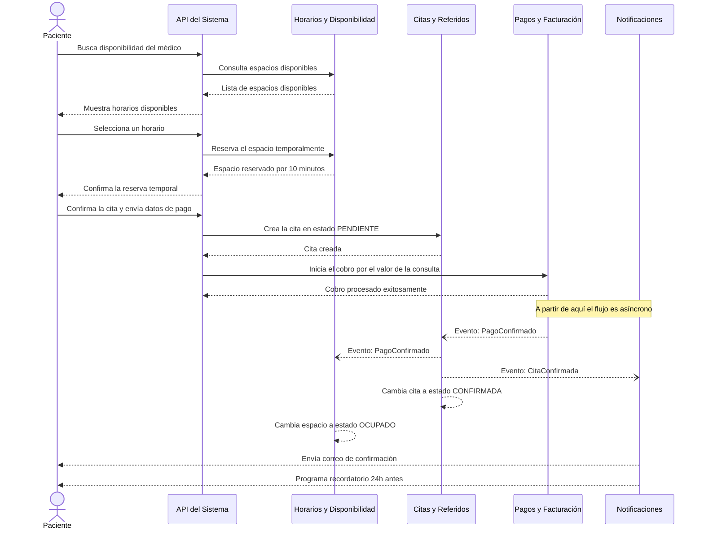
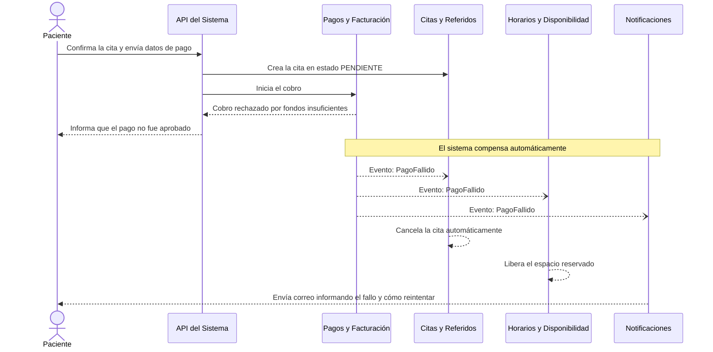
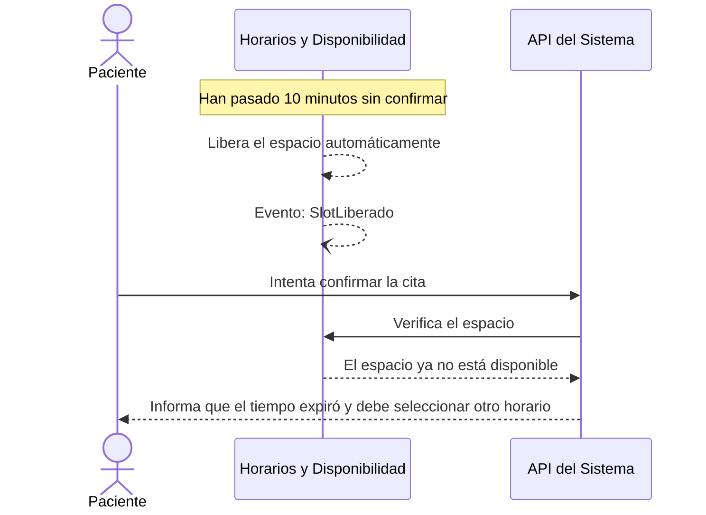
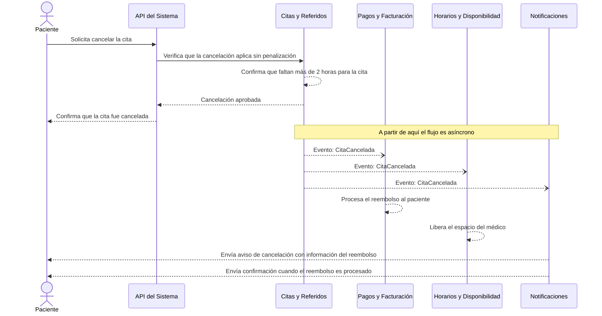
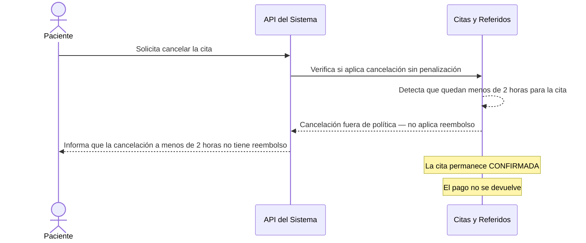
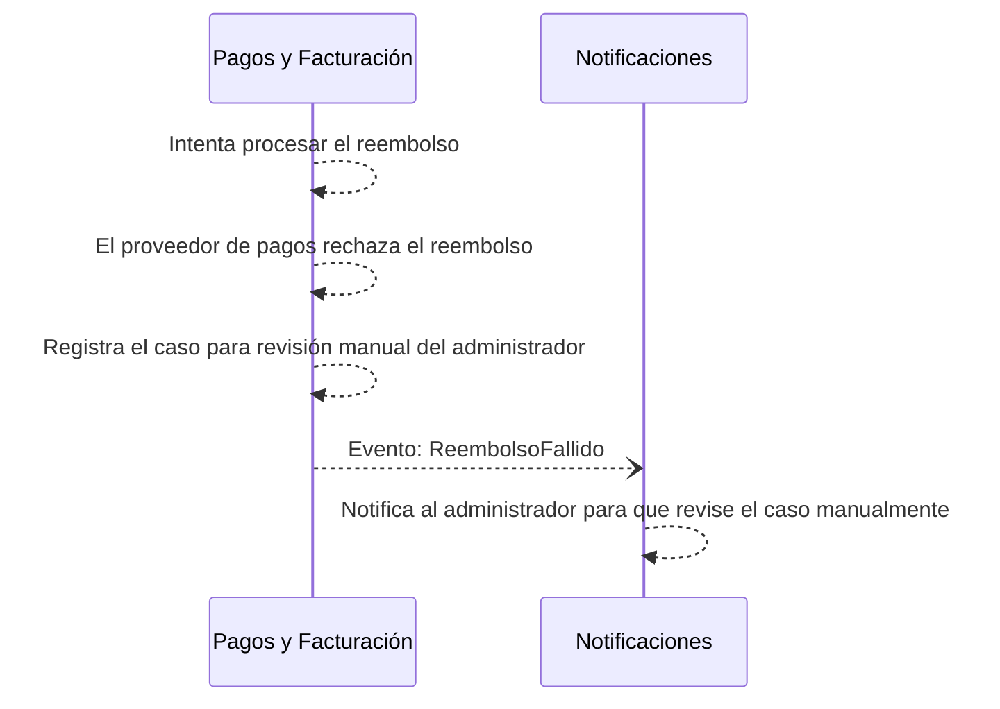
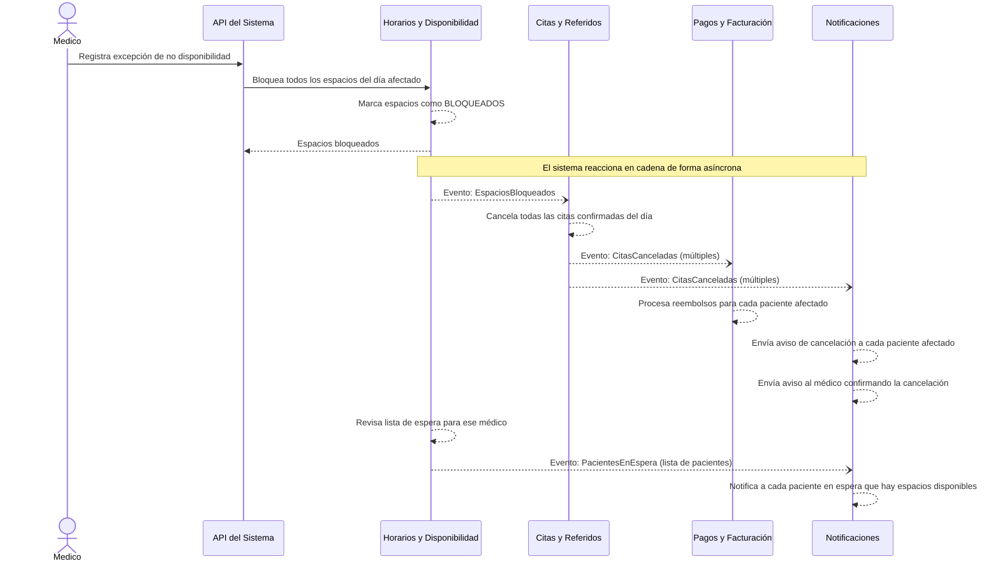
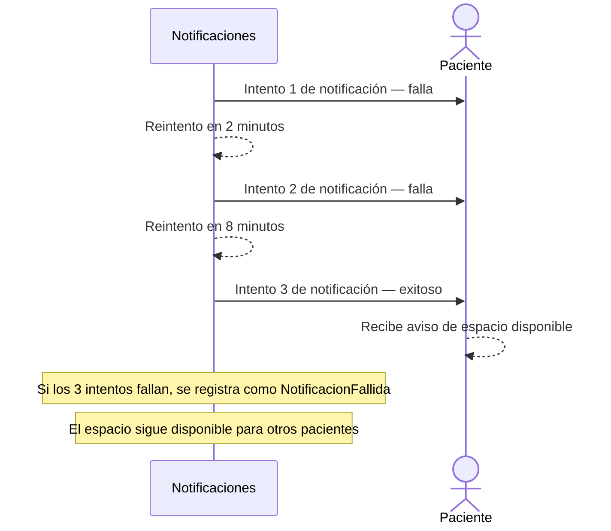

# 04 — Flujos de Datos e Interacciones

Se describen los **3 flujos principales** del sistema. Cada uno incluye el escenario de negocio, un diagrama de secuencia, el camino feliz y al menos un camino de fallo o compensación.

---

## Flujo 1 — Agendamiento de Cita y Pago

### Escenario

Un paciente busca disponibilidad de un médico, selecciona un horario, completa el pago y recibe la confirmación de su cita. Este es el flujo central del sistema.

### Camino Feliz

### Camino de Fallo — Pago Rechazado

### Camino de Fallo — Espacio Expirado

---

## Flujo 2 — Cancelación de Cita y Reembolso

### Escenario

Un paciente cancela una cita confirmada con más de 2 horas de anticipación. El sistema libera el espacio del médico, procesa el reembolso y notifica a ambas partes. Si el reembolso falla, el sistema lo registra para revisión manual.

### Camino Feliz

### Camino de Fallo — Cancelación Fuera de Política

### Camino de Fallo — Reembolso Rechazado por el Proveedor

---

## Flujo 3 — Médico Cancela y Pacientes en Lista de Espera son Notificados

### Escenario

Un médico marca un día como no disponible por una emergencia. El sistema cancela todas las citas confirmadas de ese día, reembolsa a los pacientes afectados, libera los espacios y notifica automáticamente a los pacientes que estaban en lista de espera para ese médico.

### Camino Feliz

### Camino de Fallo — Fallo al Notificar a Pacientes en Lista de Espera

